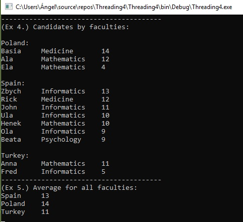
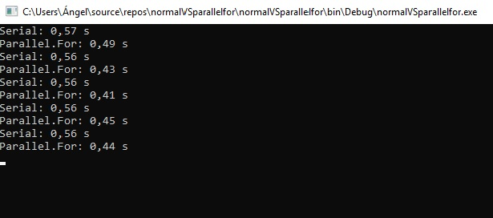

# Concurrent Programing

[LINQ](Linq/)
* **exampleLinq.cs** - Example to calculate the average marks of diferents students 
in differents countries 

 The syntax is similar to the one in SQL, but with the advantage that we have the power of .net and visual studio when coding. With lambda, we can directly call functions where, join, select, directly from the object.

  ```
  var result3 =
            from s in students
            group s by s.Country into groups

            select new
            {
                Country = groups.Key,
                AverageMarks = groups.Max(s => s.Marks),
            };
  ```
  

[NORMAL VS PARALLEL LOOP](NormalVSParallelLoop/)
* **normalVSparallelloop.cs** - Example about how much faster is parallel loop than the normal 
version

 Parallel.For and normal For loop both share the similar syntax, but the parallel loop runs faster on a computer that has available cores. Another difference is that, unlike a sequential loop, the order of execution isn't defined for a parallel loop. Steps often take place at the same time, in parallel.

```
for (int i = 0; i < 5; i++)
            {
		//initialize watch and process in serial
                Stopwatch sw = Stopwatch.StartNew();
                Serial(array, 2);
                Console.WriteLine("Serial: {0:f2} s", sw.Elapsed.TotalSeconds);
		//initialize watch and process in parallel
                sw = Stopwatch.StartNew();
                ParallelFor(array, 2);
                Console.WriteLine("Parallel.For: {0:f2} s", sw.Elapsed.TotalSeconds);

            }
static void Serial(double[] array, double factor)
        {
            for (int i = 0; i < array.Length; i++)
            {
                array[i] = array[i] * factor;
            }

        }

        static void ParallelFor(double[] array, double factor)
        {
	//First we indicate the source index for the first iteration of the loop. Then how far do we want to go, exclusively. Finally, we define an Action. The action is what will be executed.
            Parallel.For(
                0, array.Length, i => { array[i] = array[i] * factor; });
        }
```

  

[PERFECT NUMBERS](PerfectNumbers/)
* **perfectNumberwithParallel.cs** - Perfect Numbers using parallel for
  Can improve performance a lot by parallelizing your code, but it also has overhead (synchronization between threads, invoking the delegate on each iteration).
```
GoPerfect(1, 50000, "Normal Loop");

        Console.WriteLine(" --------------------------- ");

        GoPerfectParallel(1, 75000, "Parallel Loop");
//the difference between both methods is the use of two longs in parallel and other kind of loop where the first two parameters specify the initial and final iteration values. 
    //The third parameter is where the local state is initialized
    static bool PerfectNumbersParallel(long n)
    {
        long s = 0;
        long k = n / 2 + 1;
        Parallel.For(1, k, i =>
        {
            if (n % i == 0)
            {
                s += i;
            }
        });
        if (n == s) return true;
        else return false;
    }
```

* **perfectNumberwithThreads.cs** - Perfect Numbers using differents threads
 The task is more abstract than the threads. It is created in the subprocess group that already has threads created by the system to improve performance.Tasks are usually created in the subprocess group and they are treated as background subprocesses.
```
GoPerfect(2, 35000, "main thread (1) --> ");
        GoPerfect(35001, 70000, "main thread (2) --> ");

        Console.WriteLine("---------------------");
	
	//Creation of the threads with call to the method GoPerfect
        Task task2 = new Task(() => GoPerfect(2, 35000, "2nd thread ------>"));
        task2.Start();

        Task task3 = new Task(() => GoPerfect(35001, 70000, "3rd thread ------> "));
        task3.Start();

        Task task4 = new Task(() => GoPerfect(50001, 80000, "4rd thread ------> "));
        task4.Start();

static bool PerfectNumbers(long n)
    {
        long s = 0;
        for (int i = 1; i <= n / 2 + 1; i++)
        {
            if (n % i == 0)
            {
                s += i;
            }
        }
        if (n == s) return true;
        else return false;
    }
```

[USES WITH THREADS](UseswithThreads/)
* **createThreads.cs** - Creation of differents threads
 Thread is a light weight process which helps in running the tasks in parallel. The threads works independently and provides the maximum utilization of the CPU, thus enhancing the CPU performance.
```
//Creation of differents threads and initialize
        Thread t = new Thread(new ThreadStart(Go));
        t.Start();   // Run Go() on the new thread.
        Go();        // Simultaneously run Go() in the main thread.

        Thread t2 = new Thread(Go);    // No need to explicitly use ThreadStart
        t2.Start();

        Thread t3 = new Thread(() => Console.WriteLine("Lambda has created this thread"));
        t3.Start();

        Thread t4 = new Thread(() => Print("Our parameter"));
        t4.Start();

//Use of lambda to write in the differents threads
        for (int i = 0; i < 10; i++)
            new Thread(() => Console.Write(i)).Start();

        Console.WriteLine();

        for (int j = 0; j < 10; j++)
        {
            int temp = j;
            new Thread(() => Console.Write(temp)).Start();
        }
```
* **threadsJoin.cs** - Creation of threads using join
 The join method causes the Thread from where that method is invoked, to be blocked until the thread invoked ends.
```
Go(50, "0--> ");

        Thread t = new Thread(() => Go(40, "1--> "));
        t.Start();

        Thread t2 = new Thread(() => Go(40, "2--> "));
        t2.Start();


        Thread t3 = new Thread(() => Go(40, "3--> "));
        t3.Start();
	//to ensute that a thread has been terminated, if the thread has already termined the returns immediately
        t3.Join();

        Thread t4 = new Thread(() => Print(DateTime.Now.ToString("HH:mm:ss tt")));
        t4.Start();
static long Fibo(int n)
    {
        int f = 0;
        int a = 1, b = 1;
        if (n == 1 || n == 2)
        {
            f = 1;
            return f;
        }
        for (int i = 3; i <= n; i++)
        {
            f = a + b;
            a = b;
            b = f;
        }
        return f;

    }
```